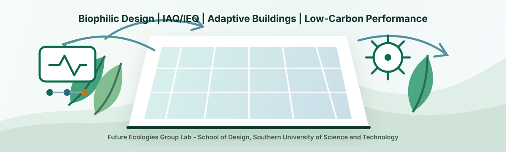

  

<h1>Umaru Mohammed</h1>

<strong>Doctoral Researcher | Future Ecologies Group Lab | School of Design, SUSTech</strong>

Advancing adaptive, nature-based, and sustainable buildings for healthier, low-carbon indoor environments.

  
  
  
  
  

## Research Identity

I am Umaru Mohammed, a doctoral researcher in the Future Ecologies Group Lab at the School of Design, Southern University of Science and Technology. My work connects biophilic and adaptive design with indoor air quality, indoor environmental quality, building performance simulation, and intelligent sensing for sustainable built environments.

My current PhD research investigates how nature-based design strategies and adaptive building systems can be sensed, simulated, and optimized to improve indoor environmental health while reducing energy demand and operational carbon.

## Research Focus

| Theme | Scientific keywords |
| --- | --- |
| Biophilic and nature-based design | restorative indoor environments, human-centered design, ecological design strategies |
| Adaptive buildings | climate-responsive envelopes, adaptive systems, integrated facade thinking |
| IAQ and IEQ | indoor air quality, indoor environmental quality, ventilation effectiveness, thermal comfort |
| Performance simulation | CFD airflow analysis, daylight evaluation, building energy modeling, nZEB pathways |
| Intelligent environments | IoT sensing, environmental monitoring, data-informed design, AI-supported workflows |
| Low-carbon futures | sustainable built environments, operational carbon reduction, passive and hybrid strategies |

## Methods I Am Developing

- Coupling building performance simulation with IAQ/IEQ evidence for healthier indoor environments.
- Using CFD airflow analysis to study ventilation, contaminant transport, and adaptive environmental strategies.
- Connecting IoT-based sensing with biophilic design evaluation and building operation feedback.
- Studying daylight, thermal comfort, and energy performance as integrated design variables.
- Translating research findings into reproducible notebooks, diagrams, and open academic workflows.

## Current GitHub Direction

This profile will grow into a research code and knowledge hub for:

- Building performance simulation workflows.
- IAQ/IEQ sensor data processing and visualization.
- CFD airflow study notes and reproducible analysis templates.
- Literature maps for biophilic design, adaptive buildings, and low-carbon indoor environments.
- Portfolio projects connected to sustainable, intelligent, and nature-based design.

## Selected Research Outputs

- [Performance Assessment of the Earth Tube Cooling Systems for Buildings in Sub-tropical Climates](https://doi.org/10.1007/978-3-032-14019-7_3), 2026.
- [PhD Forum Abstract: IoT-Supported Biophilic Design for Human-Centered Net-Zero Buildings](https://doi.org/10.1145/3736425.3772193), 2025.
- [Indoor environment PV applications: Estimation of the maximum harvestable power](https://doi.org/10.1016/j.rser.2024.114287), 2024.
- [A Performance Quality Index to Assess Professional Conduct of Contractors at Sustainable Construction Projects in Saudi Arabia](https://doi.org/10.3390/su15097500), 2023.

## Academic Links

- Portfolio: [umaru-mhd.github.io](https://umaru-mhd.github.io/)
- Future Ecologies Group Lab: [future-ecologies.group/members](https://future-ecologies.group/members/)
- ORCID: [0000-0002-1492-6336](https://orcid.org/0000-0002-1492-6336)
- Google Scholar: [Umaru Mohammed](https://scholar.google.com/citations?user=dKAAhqsAAAAJ&hl=en)
- ResearchGate: [B-Umaru-Mohammed](https://www.researchgate.net/profile/B-Umaru-Mohammed?ev=hdr_xprf)
- LinkedIn: [umarumohammed](https://www.linkedin.com/in/umarumohammed/)

## Research Keywords

`biophilic design` `adaptive buildings` `nature-based design` `IAQ` `IEQ` `IoT sensing` `CFD airflow` `thermal comfort` `daylight` `building performance simulation` `nZEB` `low-carbon buildings` `sustainable built environments`

---

  Building healthier indoor environments through ecological intelligence, sensing, and performance-driven design.

